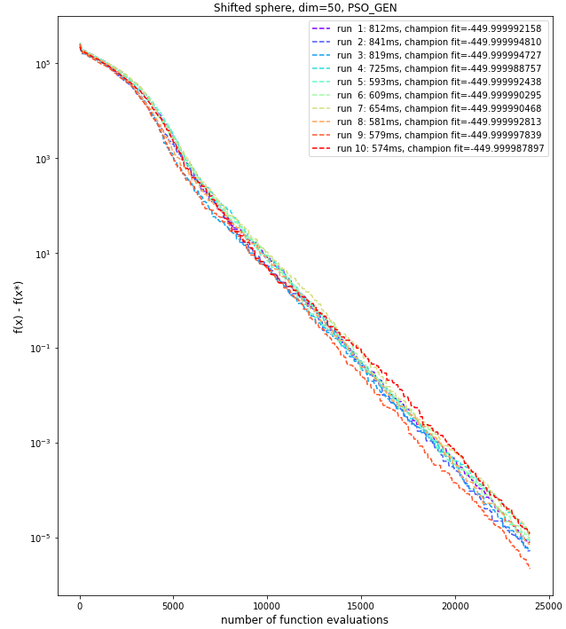

# Shifted Sphere problem
The Shifted Sphere problem is described below as per the **CEC'2008 competition** on large scale global optimisation:

This problem has only one optimum. We will therefore favor **intensification** over **diversification**.

## Dimension 50, 10 runs
In dimension 50, we use the **Particle Swarm Optimisation GENerational** algorithm (from Pygmo package), with the following configuration:

|config. name|value|
|------------|-----|
|Inertia weight|0.7|
|Social component|0.5|
|cognitive component|4|
|Maximum velocity|0.05|
|Algorithmic variant|FIPS|
|Swarm topology|local best|

We run the algorithm with a ***population size of 30***, and ***800 generations***. With this configuration, our best run gives the following results:

|Results| |
|------------|-----|
|Number of function evaluations|24,000|
|Duration|668 ms|
|Best f value|-449.9999978|
|Difference with function's optimum value|0.0000022|
|L2 norm to optimum solution|0.0014702|
|Swarm topology|local best|

## Dimension 500, 10 runs