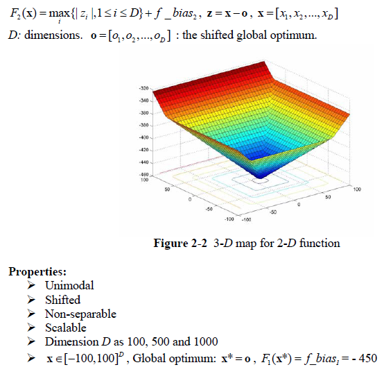
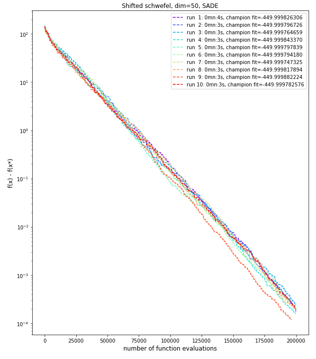
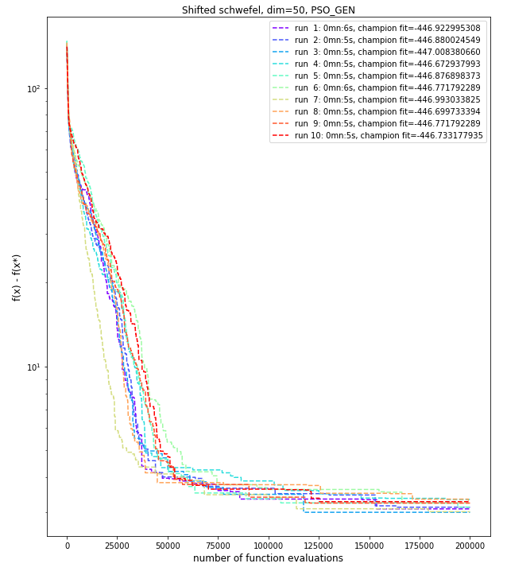
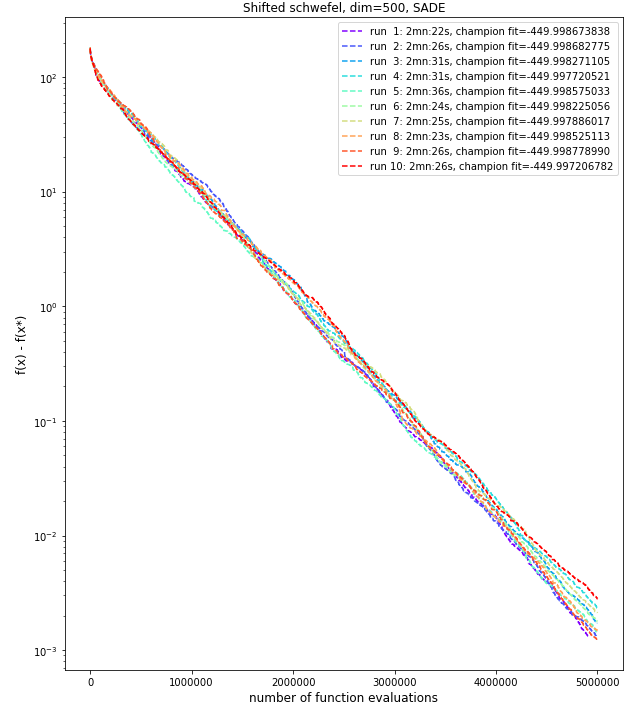

# Shifted Schwefel problem
The Shifted Schwefel problem is described below as per the CEC'2008 competition on large scale global optimisation:

## Dimension 50, 10 runs
This problem is a unimodal function and therefore a favoring **intensification** over **diversification** seems to be a good idea.  However, given the shape of the function and possible "plateaux" close to the optimum, having a good balance between both works better.

We've tried both **Particle Swarm Optimisation GENerational** algorithm and the **Self-Adaptative Differential Evolution** algorithms, with PSO_GEN being quickly stuck close to the optimum. SADE on the controry can easily converge to the optimum.

Configuration used for PSO_GEN and SADE were:

|PSO-GEN parameter|value|
|------------|-----|
|Inertia weight|0.72|
|Social component|2.05|
|cognitive component|2.05|
|Maximum velocity|0.03|
|Algorithmic variant|same social and cognitive random|
|Swarm topology|global best|

|SADE parameter|value|
|------------|-----|
|mutation variant|rand-to-best-and-current/2/bin|
|variant_adptv|1 (jDE)|
|ftol|1e-04|
|xtol|1e-03|

We ran the both algorithms with ***population size of 50*** and ***4000 generations***. As said earlier, SADE could converge whereas PSO_GEN could not in that configuration of population size/generations.

The best results for SADE and GEN-PSO are presented below.

|SADE Results| |
|------------|-----|
|Number of function evaluations|196,300|
|Duration|3 s|
|Best f value|-449.9998822|
|Difference with function's optimum value|0.0001178|
|L2 norm to optimum solution|0.0005107|

A plot of the fitness value as a function of the number of evaluation is shown below (with y axes using a log scale).

|PSO-GEN Results| |
|------------|-----|
|Number of function evaluations|200,000|
|Duration|5 s|
|Best f value|-447.0083807|
|Difference with function's optimum value|2.9916193|
|L2 norm to optimum solution|10.9196091|

A plot of the fitness value as a function of the number of evaluation is shown below (with y axes using a log scale).

## Dimension 500, 10 runs
In dimension 500, we again used the **Self-Adaptative Differential Evolution** with the same configuration. Because of this problem being unimodal we could choose to keep a low population (i.e. favoring **intensification**). The best results obtained for a ***population size of 50*** and ***100000 generations*** are shown below:

|SADE Results| |
|------------|-----|
|Number of function evaluations|5,000,000|
|Duration|2mn:26s|
|Best f value|-449.9987790|
|Difference with function's optimum value| 0.0012210|
|L2 norm to optimum solution|0.0130240|

A plot of the fitness value as a function of the number of evaluation is shown below (with y axes using a log scale).

