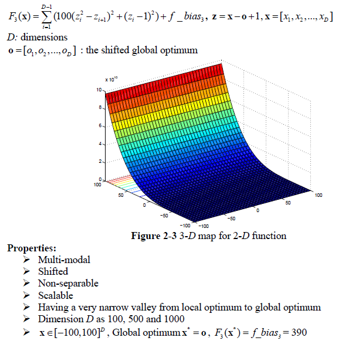
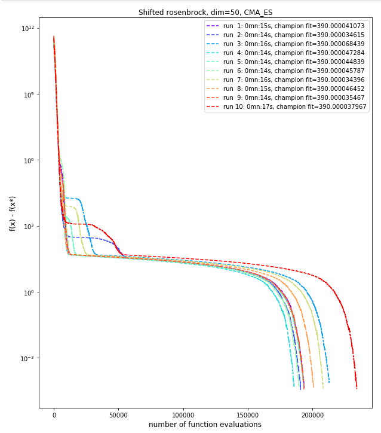
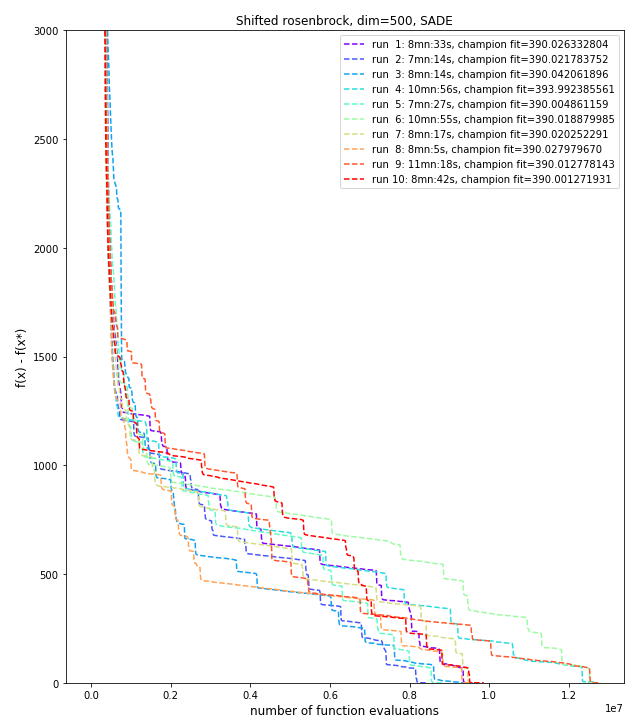

# Shifted Rosenbrock problem
The Shifted Rosenbrock problem is described below as per the CEC'2008 competition on large scale global optimisation:

This problem has one global minimum, but quite difficult to find as being a long, narrow, parabolic shaped flat valley. It is likely that a good balance between **Diversification** (to find the valley) and **intensification** (to converge to the global minimum) will work well.

## Dimension 50, 10 runs
We use the **Covariance Matrix Adaptation Evolution Strategy** (CMA-ES) which gave good results in a low number of function evaluations for that tricky problem. Configuration of CMA-ES is minimal:

|CMA-ES parameter|value|
|------------|-----|
|Initial step size|0.3|
|ftol|1e-04|
|xtol|1e-04|

We ran the CMA-ES algorithm with a ***population size of 50*** and ***6000 generations***. With this configuration, our best run gave the following results:

|CMA-ES Results| |
|------------|-----|
|Number of function evaluations|208,650|
|Duration|16s|
|Best f value|390.0000344|
|Difference with function's optimum value|0.0000344|
|L2 norm to optimum solution|0.0023214|

A plot of the fitness value as a function of the number of evaluation is shown below (with y axes using a log scale).

## Dimension 500, 10 runs
In this large dimension, like already noticed for other functions, the CMA-ES algorithm is not working well, being too computational intensive. We used instead the **Self-Adaptative Differential Evolution** with a mutation variant that uses both random current solutions and the best solution so far to create new trial solution. In addition we set the step size stopping condition quite low, so that the algorithm won't stop too early.

|SADE parameter|value|
|------------|-----|
|mutation variant|rand-to-best-and-current/2/bin|
|variant_adptv|1 (jDE)|
|ftol|1e-04|
|xtol|1e-06|

We ran the SADE algorithm with a ***population size of 50*** and ***400000 generations***. With this configuration, our best run gave the following results:

|SADE Results| |
|------------|-----|
|Number of function evaluations|9,861,300|
|Duration|8mn:42s|
|Best f value|390.0012719|
|Difference with function's optimum value|0.0012719|
|L2 norm to optimum solution|0.0132404|

A plot of the fitness value as a function of the number of evaluation is shown below (with y axes using a log scale).

