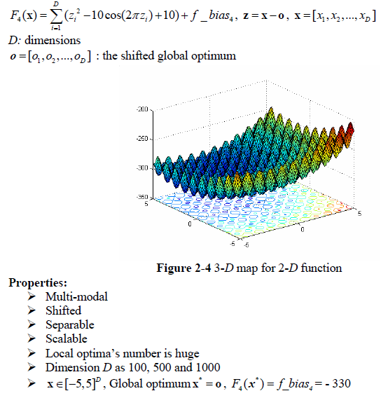
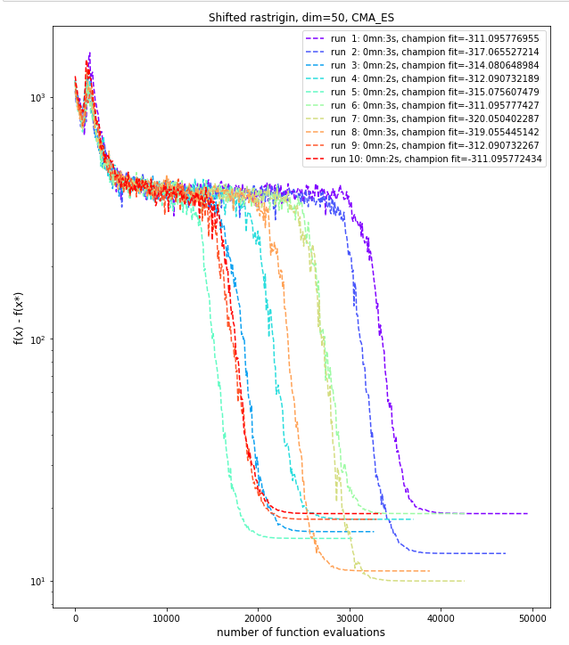
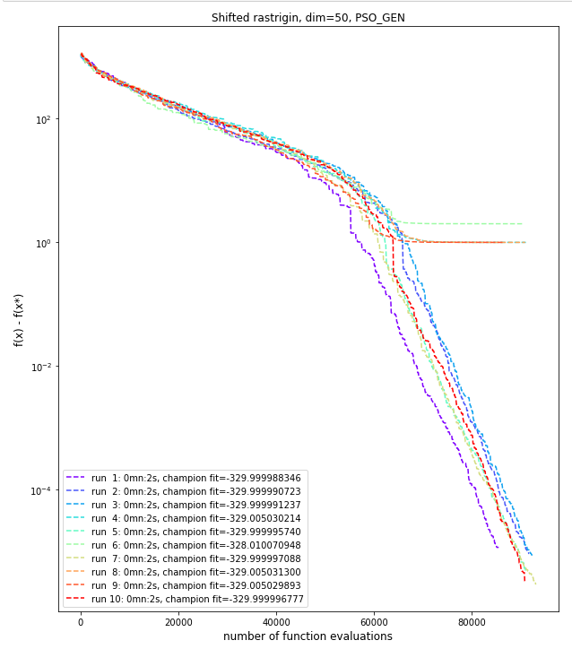
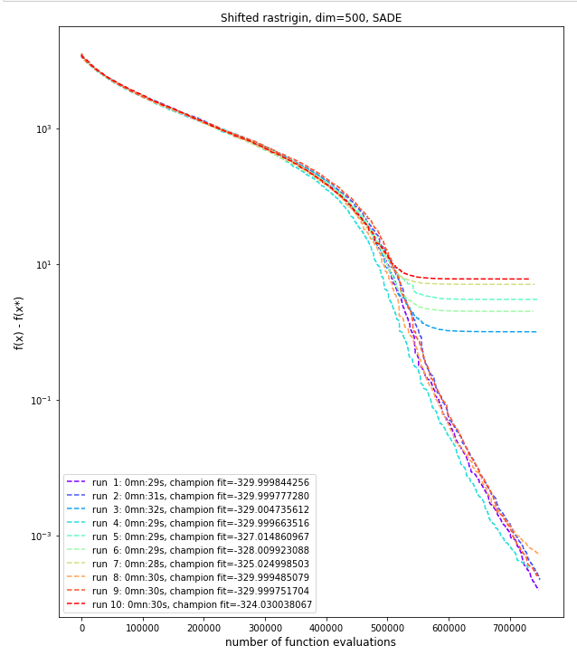

# Shifted Rastrigin problem
The Shifted Rastrigin problem is described below as per the **CEC'2008 competition** on large scale global optimisation:

This problem has one global minimum and many local minima. The size of the minima are big enough so that algorithms could be easily trapped into a local minima. **Diversification** will be essential for finding the global optimum.

## Dimension 50, 10 runs
In dimension 50 we tried both the **Covariance Matrix Adaptation Evolution Strategy** (CMA-ES) and **Self-Adaptative Differential Evolution** (SADE) algorithms. Whereas CMA-ES is giving good and fast results for some other functions in low dimension (e.g. ***shifted griewank***), it here gets trapped easily in local minima and stops prematurely. On the contrary, SADE performs well, finding the global minimum in less than 95,000 function evaluations. We've chosen a SADE variant that encourages **intensification** (with best individuals kept for generating target vector by mutation) to avoid being trapped into local optima, and increased population size for **diversification**.

Configuration CMA-ES and SADE are listed below:

|CMA-ES parameter|value|
|------------|-----|
|Initial step size|0.3|
|ftol|1e-05|
|xtol|1e-05|

|SADE parameter|value|
|------------|-----|
|mutation variant|best/1/exp|
|variant_adptv|1 (jDE)|
|ftol|1e-04|
|xtol|1e-03|

We ran the CMA-ES algorithm with a ***population size of 100*** and ***1000 generations***. We ran the SADE algorithm with a ***population size of 75*** and ***1500 generations***.

The best results for both algorithms are detailed below.

|CMA-ES Results| |
|------------|-----|
|Number of function evaluations|42,700|
|Duration|3 s|
|Best f value|-320.0504023|
|Difference with function's optimum value|9.9495977|
|L2 norm to optimum solution|3.1463287|

A plot of the fitness value as a function of the number of evaluation is shown below (with y axes using a log scale).

|SADE Results| |
|------------|-----|
|Number of function evaluations|93,075|
|Duration|2 s|
|Best f value|-329.9999971|
|Difference with function's optimum value|0.0000029|
|L2 norm to optimum solution|0.0001212|

A plot of the fitness value as a function of the number of evaluation is shown below (with y axes using a log scale).

## Dimension 500, 10 runs
In dimension 500, we again used the **Self-Adaptative Differential Evolution** with the same configuration, however obviously increasing the number of generations. The best result obtained for a ***population size of 50*** and ***15,000 generations*** is shown below:

|SADE Results| |
|------------|-----|
|Number of function evaluations|747,200|
|Duration|29s|
|Best f value|-329.9998443|
|Difference with function's optimum value| 0.0001557|
|L2 norm to optimum solution|0.0008860|

A plot of the fitness value as a function of the number of evaluation is shown below (with y axes using a log scale).

