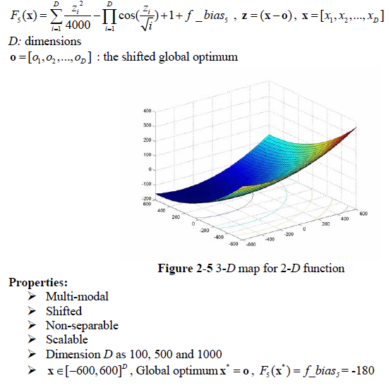
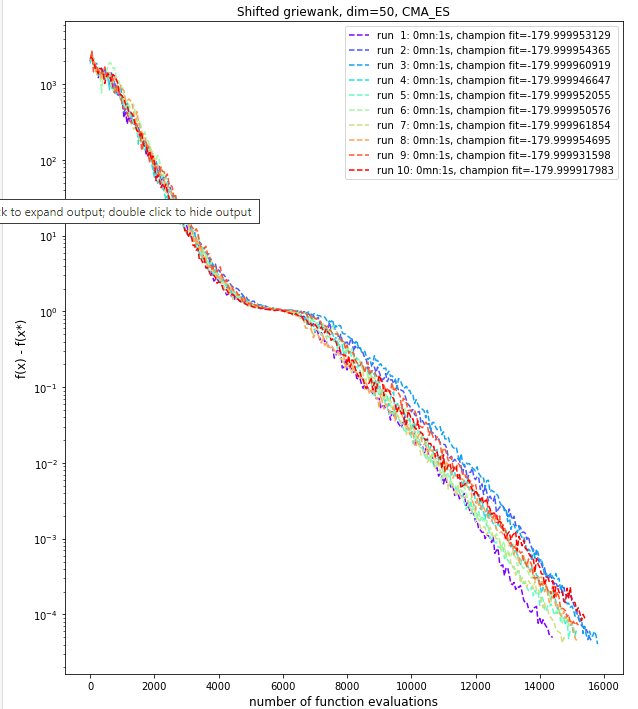
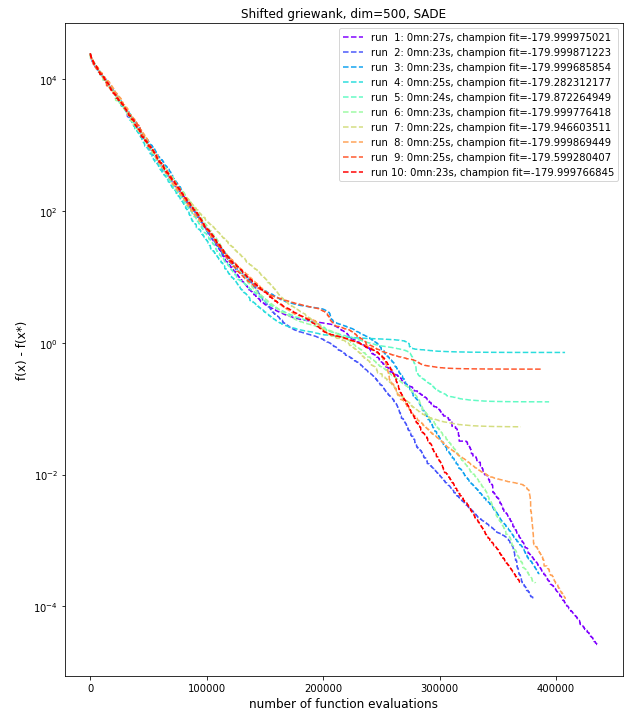

# Shifted Griewank problem
The Shifted Griewank problem is described below as per the **CEC'2008 competition** on large scale global optimisation:

This problem has one global minimum but an exponentially increasing number of local minima as the dimension increases. **Diversification** will be essential for finding the global optimum while getting good performance.

Despite having an exponentially increasing number of local minima, the chosen algorithms worked quite well on this problem, and the global minimum could be found quickly, thanks to the particular definition of this function where the local minima are *"easily"* avoided, being smaller and smaller as the dimension increases (as Dimension product of values within the [-1,1] interval).

## Dimension 50, 10 runs
We've used **Covariance Matrix Adaptation Evolution Strategy** (CMA-ES) algorithm, which requires only a few configuration parameters to work well (mainly the initial step size, and stop conditions). Other parameters are infered by the algorihtm. The algorithm works well on this particular problem, with a convergence to the global minimum reached in about 1 second.

|CMA-ES parameter|value|
|------------|-----|
|Initial step size|0.3|
|ftol|1e-04|
|xtol|1e-04|

We ran the algorithm with a ***population size of 50*** and ***500 generations***. With this configuration, our best run gave the following results:

|CMA-ES Results| |
|------------|-----|
|Number of function evaluations|14,850|
|Duration|0mn:1s|
|Best f value|-179.9999619|
|Difference with function's optimum value|0.0000381|
|L2 norm to optimum solution|0.0428656|

A plot of the fitness value as a function of the number of evaluation is shown below (with y axes using a log scale).

## Dimension 500, 10 runs
For dimension 500, CMA-ES is really slow (due to computation of huge co-variance matrix) and we turned to the **Self-Adaptative Differential Evolution** (SADE) algorithm. We used **diversification** by increasing the **population size to 100** and choosing a SADE variant with a higher number of pairs of solutions to compute the mutation. We use **5000 generations**.

|SADE parameter|value|
|------------|-----|
|mutation variant|rand-to-current/2/bin|
|variant_adptv|1 (jDE)|
|ftol|1e-04|
|xtol|1e-03|

The best result for this configuration is presented below.

|SADE Results| |
|------------|-----|
|Number of function evaluations|435,700|
|Duration|0mn:27s|
|Best f value|-179.9999750|
|Difference with function's optimum value|0.0000250|
|L2 norm to optimum solution|0.1051056|

A plot of the fitness value as a function of the number of evaluation is shown below (with y axes using a log scale).

