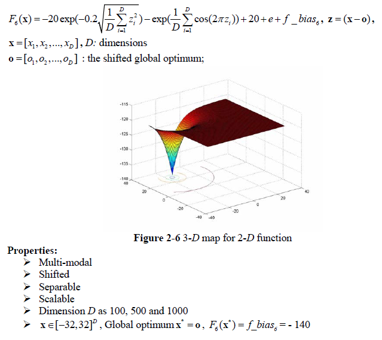
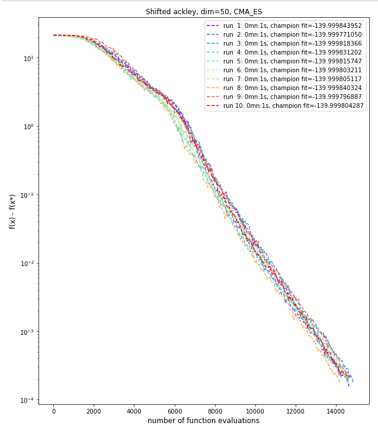
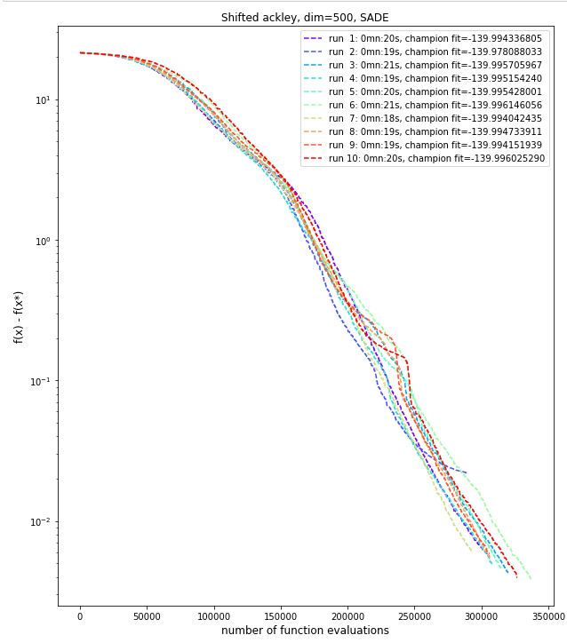

# Shifted Ackley problem
The Shifted Ackley problem is described below as per the **CEC'2008 competition** on large scale global optimisation:

This problem has one global minimum (a large hole at the centre) with a nearly flat outer region with many local minima. **Diversification** will be essential.

## Dimension 50, 10 runs
We've again used the **Covariance Matrix Adaptation Evolution Strategy** (CMA-ES) algorithm, which works well on this particular problem, with a convergence to the global minimum reached in about 1 second.

|CMA-ES parameter|value|
|------------|-----|
|Initial step size|0.3|
|ftol|1e-04|
|xtol|1e-04|

We ran the algorithm with a ***population size of 50*** and ***500 generations***. With this configuration, our best run gave the following results:

|CMA-ES Results| |
|------------|-----|
|Number of function evaluations|14,700|
|Duration|0mn:1s|
|Best f value|-139.9998440|
|Difference with function's optimum value|0.0001560|
|L2 norm to optimum solution|0.0002757|

A plot of the fitness value as a function of the number of evaluation is shown below (with y axes using a log scale).

## Dimension 500, 10 runs
Here again, CMA-ES is really slow for that dimension (due to computation of huge co-variance matrix) and we turned to the **Self-Adaptative Differential Evolution** (SADE) algorithm. We used **diversification** by increasing the **population size to 75** and choosing a SADE variant that favor diversification (using 3 pairs of random current solution to compute mutation of a new trial solution). We also set the step size stopping condition to a low value to avoid early stopping. We use **5000 generations**.

|SADE parameter|value|
|------------|-----|
|mutation variant|rand/3/bin|
|variant_adptv|1 (jDE)|
|ftol|1e-04|
|xtol|1e-06|

The best result for this configuration is shown below.

|SADE Results| |
|------------|-----|
|Number of function evaluations|336,900|
|Duration|0mn:21s|
|Best f value|-139.9961461|
|Difference with function's optimum value|0.0038539|
|L2 norm to optimum solution|0.0212747|

A plot of the fitness value as a function of the number of evaluation is shown below (with y axes using a log scale).

