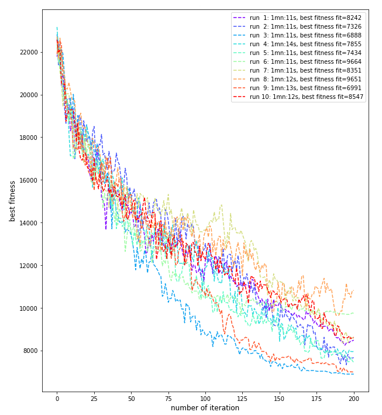
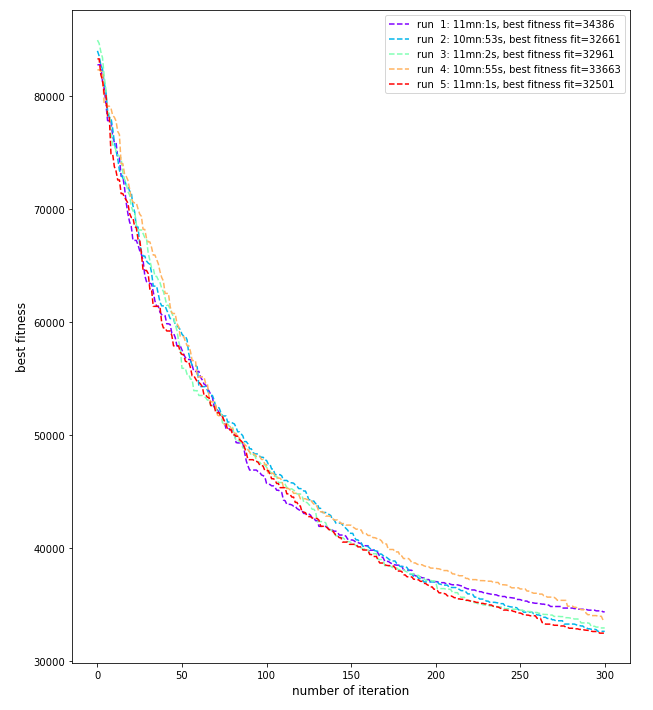

# Travelling Salesman Problems
We are aiming at solving two TS problems:
* **Djibouti**: 38 cities, for which the ultimate tour is known and has a length of **6656** (see [here](http://www.math.uwaterloo.ca/tsp/world/djtour.html)).
* **Qatar**: 194 cities, for which the ultimate tour is also known and ahs a lenght of **9352** (see [here](http://www.math.uwaterloo.ca/tsp/world/qatour.html)).

To solve these problems we've decided to implement our own GA algorithm, for which we have implemented 1 selection operator (**Selection_Tournament**), 1 crossover operator (**Crossover_Ordered**) and 3 mutation operators (**Mutation_Swap**, **Mutation_Inversion** and **Mutation_Scramble**).

We intent to implement other selection and crossover operators in the near future to be able to try different methods for solving these problems.

Our Genetic Algorithm has been designed with concepts inspired by the **pygmo** package, that is:
* A problem: the problem is defined as a **class** with a method that implement a computation of the fitness for this particular class of problem.
* A population: the population, also defined as a **class**, represent the solution space and keep track of the best solution.
* An algorithm: A **class** that implement the chosen algorithm to run the problem. We only have implemented the Genetic Algorithm, and again with a limited set of operators.

## Djibouti
Our implementation of the GA algorithm works correctly on the **Djibouti** problem, with the following configuration:

|GA parameter|value|
|------------|-----|
|Elite ratio|0|
|Selection operator|**Tournament**, with k=2|
|Crossover operator|**Ordered**, with a crossover probability of 0.9 and a max sequence width of 10|
|Mutation operator|**Scramble** with a mutation probability of 0.1 and a max sequence width of 5|

We've made ten runs with a **population size of 300** and a **number of generation of 200**. The best run gave the following result:
* The best solution has been found in 1mn11s,
* the best path is **6888** (distance of unit) long,
* and corresponds to the following list of cities: **[34, 36, 31, 27, 28, 26, 25, 23, 20, 22, 24, 15, 13, 8, 12, 11, 17, 18, 19, 16, 9, 7, 6, 5, 3, 4, 2, 1, 10, 14, 21, 29, 30, 32, 35, 37, 38, 33, 34]**
 
A plot of the fitness value (i.e. unit of distance of the path) as a function of the number of iteration is shown below:

## Qatar
Our implementation also provide some results on this **Qatar** problem. However we could see our algorithm is quite slow, it's difficult to estimate how much, i.e. we didn't make any comparison with any other algorithm. We use the following configuration:

|GA parameter|value|
|------------|-----|
|Elite ratio|0.05|
|Selection operator|**Tournament**, with k=2|
|Crossover operator|**Ordered**, with a crossover probability of 0.9 and a max sequence width of 12|
|Mutation operator|**Scramble** with a mutation probability of 0.1 and a max sequence width of 6|

We've made five runs with a **population size of 400** and a **number of generation of 300**. The best run gave the following result:

* The best solution has been found in 11mn:1s,
* the best path is **32501** (distance of unit) long,
* and corresponds to the following list of cities: **[169, 156, 137, 125, 164, 155, 143, 133, 110, 93, 83, 35, 46, 50, 49, 4, 65, 63, 62, 25, 78, 68, 39, 51, 37, 43, 40, 67, 73, 52, 48, 38, 56, 27, 33, 21, 89, 101, 117, 88, 92, 96, 70, 72, 91, 127, 154, 153, 159, 139, 138, 147, 121, 135, 166, 171, 176, 182, 186, 190, 181, 85, 36, 13, 14, 69, 57, 30, 42, 61, 22, 12, 9, 19, 66, 77, 87, 109, 18, 7, 3, 1, 6, 8, 146, 163, 145, 104, 76, 107, 122, 152, 144, 168, 185, 191, 184, 172, 174, 165, 148, 112, 84, 44, 47, 32, 54, 28, 10, 29, 26, 60, 79, 81, 106, 124, 123, 128, 120, 141, 126, 140, 132, 149, 177, 180, 158, 151, 160, 102, 59, 82, 11, 2, 17, 23, 16, 71, 142, 150, 167, 193, 188, 178, 131, 58, 53, 41, 34, 64, 95, 100, 116, 157, 179, 187, 173, 175, 161, 130, 119, 113, 80, 20, 5, 15, 45, 55, 31, 97, 108, 136, 134, 111, 98, 86, 75, 24, 74, 105, 114, 90, 94, 99, 103, 115, 118, 129, 162, 170, 183, 189, 192, 194, 169]**

A plot of the fitness value (i.e. unit of distance of the path) as a function of the number of iteration is shown below:

